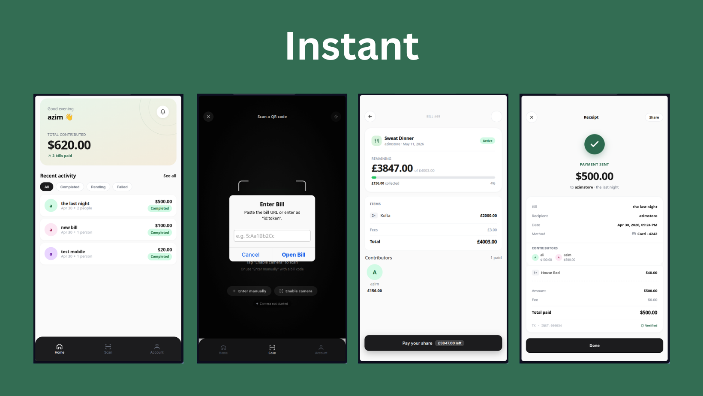

# instant

**Instant** is a fintech solution that enables merchant/users to generate shared bill/invoice and contributor can pay for the bill untill getting charged.

**Demo** : [Youtube](https://www.youtube.com/watch?v=-8foQt7gtG4)

**Endpoints** : [Here](https://nodejs-instant-api-production.up.railway.app/api-docs/)

# Design



## Overview


## Installation

```sh
git clone git@github.com:AbdoViper23/vue-ionic-instant.git
```

```sh
npm install --legacy-peer-deps
```

- To Run :

```sh
npm run dev
```

- To Build :

```sh
npm run build
```
